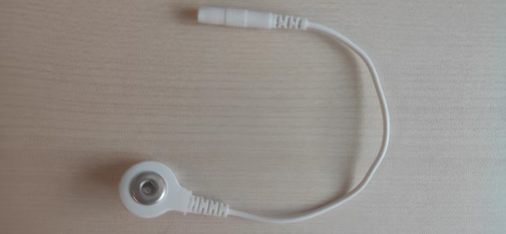

|                   Accessory Name                   |                Function                |                          Appearance                          |                           Remarks                            |
| :------------------------------------------------: | :------------------------------------: | :----------------------------------------------------------: | :----------------------------------------------------------: |
|         2mm double-ended banana plug cable         | as part of the electrode lead assembly |  |            Plug material: Gold-plated pure copper            |
|        Button type electrode adapter cable         | as part of the electrode lead assembly |  |                         2mm to 3.5mm                         |
| 3.9mm electrode snap and silver chloride electrode |          measuring electrode           |  | The silver chloride electrode needs to be riveted into the electrode snap. |
|               manual riveting pliers               |      making measuring electrodes       |  |              Avoid electrode damage during use               |
|                velcro elastic strap                |   wearable electrode securing device   |  | measuring electrode:5mm-wide strap; reference electrode:2mm-wide strap |
|        5000mAh lithium-ion polymer battery         |   as the power source for the device   |  | Dimensions: 65mm× 55mm × 9.5mm; Equipped  with a protection board and a 2.54 connector power cord |

 

