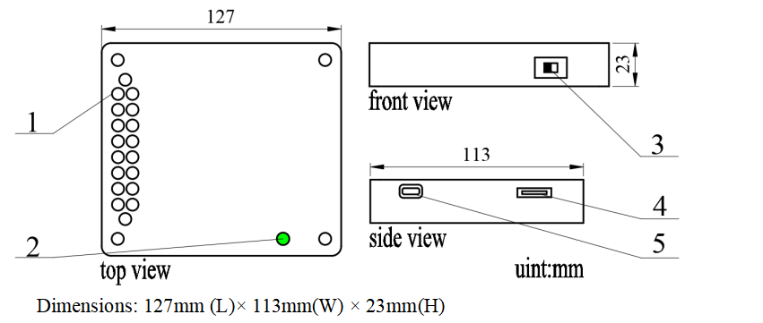
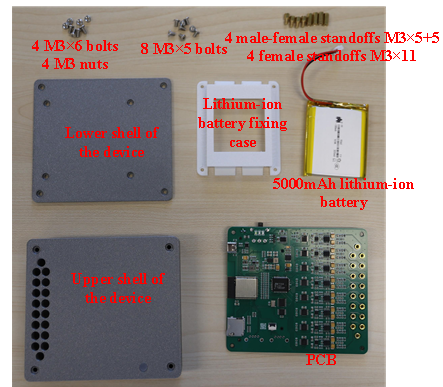
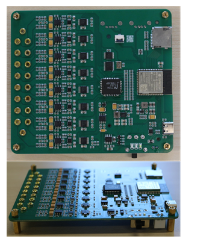
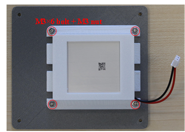
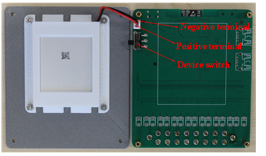
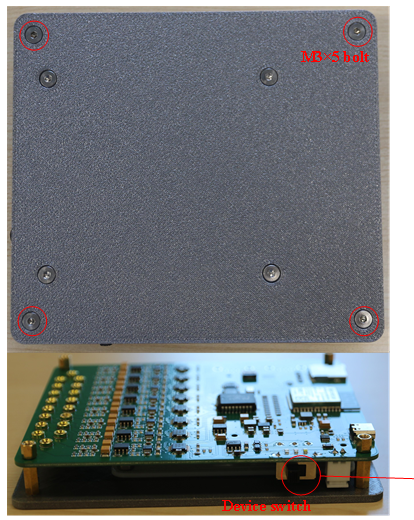
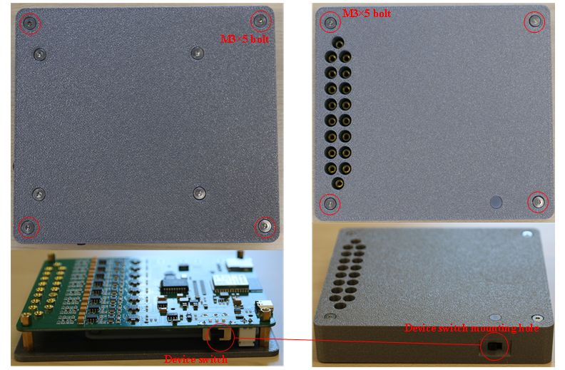
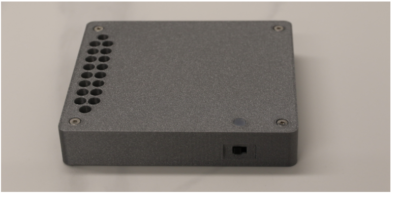
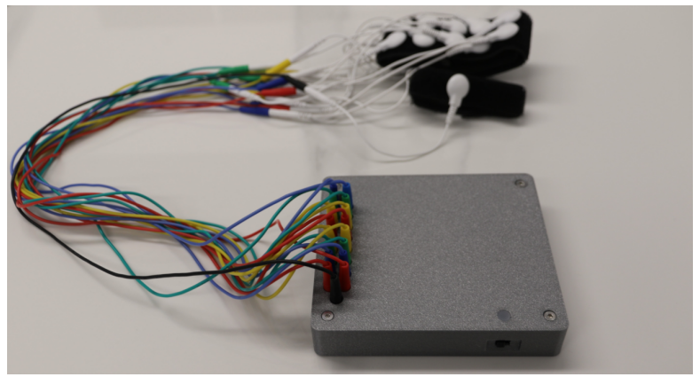

# NxBCI Hardware User Guide

## 1. Device Overview

### 1.1 Appearance and Dimensions

    

### 1.2 Component Description

As shown in the figure above:
*   **1** — 2mm banana socket
*   **2** — Device status indicator light
*   **3** — Device switch
*   **4** — MicroSD(TF) card slot
*   **5** — USB Type-C charging port

### 1.3 Package Contents

- Device main unit
- **Accessories**: Electrode wristband, electrode wires, data cable, MicroSD card.

---

## 2. Device Installation Process

> After unboxing, confirm that the device is free from physical damage and all accessories are included.

The detailed installation steps are shown below.

### Installation Steps

**1. Prepare the components for the device installation**

    

 

**2. Install PCB connecting standoffs**
- Install male-female standoffs on the top surface.
- Install female standoffs on the bottom surface.

    

 

**3. Fix the lithium-ion battery**
- Use the lithium-ion battery fixing case to fix the battery to the lower shell of the device.

    

 

**4. Connect the power cord to the PCB**
> **Note:** Ensure the correct polarity of the power supply when connecting.

    

 

**5. Fix the PCB to the lower shell of the device**

    

 

**6. Proceed to secure the PCB to the upper shell of the device**
> **Note:** After completing step 5, when placing it into the upper shell, you need to tilt it at a certain angle to first fit the side with the device switch into the upper shell, then slowly fit the other side and lay it flat.

    

 

**The fully installed device is shown in the figure below:**

    

 

---

## 3. Device Operation Guide

### 3.1 Basic Operations

-   **Power On/Off**
    NxBCI has only one physical toggle switch. Toggle the switch to the left to power off the device, and to the right to power on the device.

-   **Charging**
    Insert the USB Type-C cable into the device and connect to a power adapter providing 5V DC output with a minimum 1A current.
    > **Note:** Ensure the device is powered off during charging (toggle the switch to the left). The device status indicator light shows different charging states: red indicates charging in progress, and green indicates charging completion.

### 3.2 Function Usage

-   **Device Operating Status**
    After powering on, observe the device status indicator light:
    -   *White blinking*: The device is waiting for a network connection.
    -   *White solid*: The device is operating (i.e., data collection and transmission are in progress).

-   **Device Operating Modes**
    The device supports three operating modes: **TCP mode**, **MQTT mode**, and **TF mode**. The operating mode is switched via Bluetooth after the device is powered on, and the device will restart after switching.

-   **Data Collection**
    -   **Local TCP mode**: Both the device's Wi-Fi and Bluetooth operate in server mode. Smartphones/PCs/MACs can perform data collection and transmission via TCP connection (with a transmission bandwidth up to 16Chs * 4ksps * 24bits); meanwhile, device operating status can be retrieved or modified via Bluetooth.
    -   **Remote MQTT mode**: The device needs to connect to the MQTT service via Wi-Fi. Remote PCs/MACs can obtain data through MQTT connection. The actual data transmission bandwidth depends on network quality.
    -   **Offline recording (TF card) mode**: Wi-Fi connection is unavailable. Data is recorded to the TF card. After recording, the data saved in the TF card can be used for analysis on a PC/MAC.
    > The device's operating status is determined at startup and cannot be changed during operation. The device will restart after switching the operating mode via Bluetooth.

-   **Device Wiring**
    The device is equipped with 182 mm banana sockets. The two sockets at the top and bottom are for reference electrodes, and the middle 16 are for measurement electrodes. The connecting wires are 2mm banana plug cables by default, which connect to the electrode wristband. After wearing the wristband properly (e.g., on the forearm near the elbow), the device is ready to collect signals.

    **The wired device is shown in the figure below:**
    

        
    

### 3.3 Battery Declaration

> **IMPORTANT: PLEASE READ**
>
> The default battery configuration is a 5000 mAh lithium-ion polymer battery (65mm L x 55mm W x 9.5mm H) equipped with a protection board and a 2.54 connector power cord.
>
> **This product has not obtained UN38.3 certification, so lithium-ion batteries cannot be shipped with the device.** You will need to purchase a corresponding lithium-ion battery locally and install it properly before using the product.

---

## 4. Version Notes

The content of the Hardware User Guide will be modified as device versions change. Please stay updated on the document.