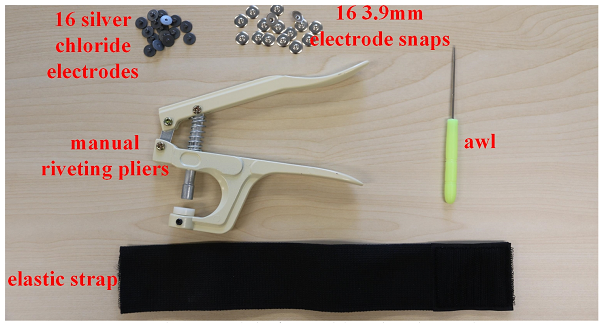
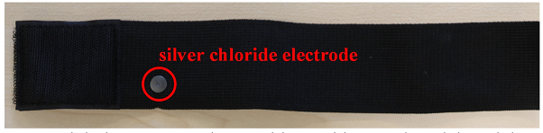
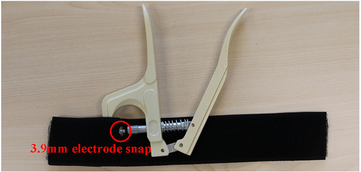
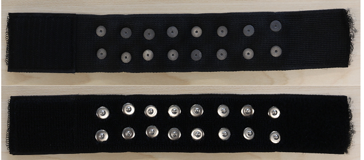

# Electrode Sleeve DIY Guide

1.  Prepare the materials for making the electrode sleeve.

    

        
    

2.  Punch holes at the appropriate positions with an awl and thread the silver chloride electrodes through.

    

        
    

3.  Use manual riveting pliers to rivet the 3.9mm electrode snaps and the silver chloride electrodes together.

    

        
    

4.  Repeat steps 2 and 3 until all 16 electrodes are fully riveted, with the horizontal and vertical spacing between each electrode being approximately 20mm.

    

        
    
