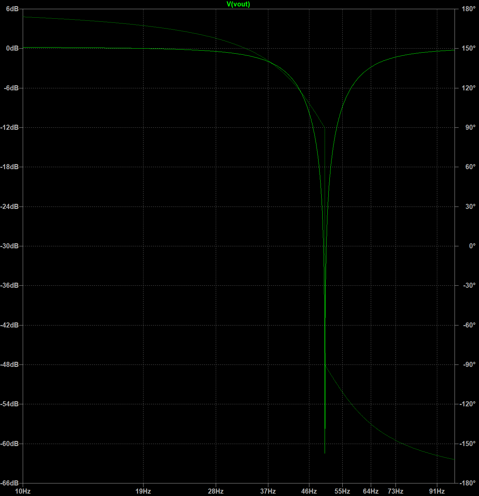

# 简介

NxBCI 开发团队是由游戏引擎程序员组成，大概在一年前我们打算为游戏增加脑机或者肌电控制能力，但是考察了现有的一些方案后都不太满意，于是我们决定自己做一个能满足需求的设备，于是有了NxBCI项目。
这篇文章介绍了 NxBCI 研发中遇到的问题以及目前选择的解决方案，如果您有好的建议请提交 [NxBCI On Github](https://github.com/neximind/NxBCI) 或者 E-Mail:<mengxin@pixelgame.net> 联系作者。

# NxBCI 硬件架构

传统的 EEG/EMG 采样电路采用基于 ADS1299 的解决方案，该器件是 TI 推出的专用于 EEG 的八通道模拟前端+ADC 芯片，具有出色的性能指标和集成度，但是对于我们的项目来说，他过于昂贵了，并且达不到 EMG 所需的高采样率（EMG测量带宽至少达到 500Hz），于是，我们采用了 低噪声AC放大器 -> 音频ADC -> FIFO -> ESP32 的整体浮地数据采集方案 ，很好的符合了项目要求。

## 交流放大器

注意到 EEG / EMG 信号特征，他们都是叠加了较强直流偏置的（由电极的极化效应产生）微弱交流信号，其中 EEG 10uV 量级，0.1-100Hz 带宽，EMG 100uV 量级 1Hz-500Hz 带宽。
如果采用 ADC 直采方案，那么就需要 ADC 具有非常好的性能（比如ADS1299），这也是 OpenBCI 采用的方案。
如果采用直流放大器，就需要高性能的仪表放大器加上直流消除电路，并且需要小心的分配增益比例以免饱和第一级仪表放大器，这种设计常见于传统的高端医疗仪器，可以利用仪表放大器的超高共模抑制比提高性能（对于非浮动的设计是必须的）。采用上面两种方案都需要较高的物料成本，而NxBCI采用了整体浮置（电池供电，WIFI数传）很大程度上减轻了共模干扰问题，采用交流放大器，以简洁的电路实现了所需的性能。

如图所示，该放大器中 R2，R3 决定了放大倍数，C2 ，R2 确定高通频率，C4 ，R3 确定了低通频率， R1 模拟了信号源的源阻抗，R4 是 ADC 的输入阻抗，根据具体需求可以在 噪声，带宽，增益之间取得平衡。

由于C2 起到关键的阻隔DC分量的作用，并且处在输入端口，这里要特别注意，不要选择陶瓷电容因其具有明显的压电效应，会拾取机械震动，钽电容或者固态铝电解电容是可行的选择，尤其是钽电容，具有更小的体积和最好的性能。对于需要更低频率的EEG测量，需要更高的 C2 （比如470uF 聚合物钽电容），在默认的PCB中我们接入了100uF 电容，在其背面留有 470uF 电容的焊盘，当您对低频信号感兴趣时可以补上这些电容以达成更低的截至频率。

经测试比对 放大器采用 OPA2188 具有最佳的性价比，尽管其是设计在高电压（36V）工作，且不具备轨到轨的输入特性，但是实验中测得在 5V 和 2.5V 共模输入电压下仍然具有很好的性能，并且具备足够的输入电平余量避免直流偏置导致的饱和。

## ADC

为了避免选用昂贵的同步采样 ADC （ADS1299，AD7606等）这里选择了 PCM1808,他是一款极其常用且廉价的立体声ADC，具有较好的交流特性，如果仔细阅读其文档，可以注意到HPF frequency response是和采样率相关的，当8K采样率时，可以低至0.16Hz，完全可以满足设计需求。其特性如下：

Digital Filter Performance
参数|值|单位
|---|---|---|
Pass band		        |0.454 fs	|Hz
Stop band		        |0.583 fs	|Hz
Pass-band ripple		|±0.05	|dB
Stop-band attenuation	|-65	|dB
Delay time		        |17.4 fs	
Digital Filter Performance	-3 dB	|0.019 fs / 1000|	

于是我们只要恰当的选择输入耦合电容，使之低频截止频率满足要求即可。 

此外实测PCM1808 的Ref是高阻抗的，猜测其内部是简单电阻分压，为了更好的一致性与噪声特行，八组 PCM1808 的Ref 都接入了 REF5025 产生的高质量参考电压（同时该电压也作为共模信号以参考电极输出）并且电源采用 TPS7A2050 供电，从而得到了很好的噪声特性。

## 时钟和FIFO

为了同步八个PCM1808（达成16通道输入），一个 4.096Hz 晶振和一个工作在主模式PCM1808 产生 SCK，BCK，LRCK 时钟信号，该信号经过 74HC541 驱动后出入到ADC板，驱动那里的从模式 PCM1808 同步工作，如果仔细阅读 IDT7204的时序，能够注意到。

将PCM1808 的BCK 作为 #W 信号即可将比特流读入 FIFO。当 FIFO 半满后通过软件读取，分帧即可完成 16 通道的数据采集,FIFO 的 D8/Q8 可以来记录和读取 LRCK ， 这样读取后软件就可以方便的分开帧数据。

尽管 4.096Mhz 的时钟频率不高，但即使微弱的时钟抖动恶化也会导致ADC性能变差，早期测试中发现越是处在时钟线远端的 ADC 噪声特性越差，在增加74HC541驱动时钟总线并在末端增加终端电阻后才得以改善到一致水平。

## 有源电极

为了应该恶劣电磁环境，我们提供了有源电极套件，该套件具有 X2 ， X5 ， X10 可选增益差分放大器，并提供 50Hz /60Hz 两种陷波版本，他的用途我们将在后面提及。

实际制作中，我们选择了 INA828 和 OPA2277 构成电路，实测取得了非常好的效果。

# NxBCI 噪声来源和对策

* 热电势

由于测量信号极低的满量程范围，模拟前端因热电势效应带来的干扰变得显著，体现为各通道趋向一致的低频噪声，尤其是用户使用裸PCB板进行测量时，即使微弱的气流都会引起明显的虚假信号，所以适当的封闭措施是必要的。

* 电容的压电效应

尽管模拟模拟前端采用的是 NP0 电容，但是出于体积和成本的考虑，其后接入ADC的耦合电容采用了X7R材质，这种介电材料有显著的压电效应，当机械振动存在时，系统会通过其拾取干扰，所以在这种环境下必要的减震措施应当被采用。

* 工频干扰

尽管采用了浮置系统，但是由于ref与input 之间阻抗并不对称，共模抑制比会被削弱，当附近有工频调制的高频干扰源时（比如不合格的开关电源）干扰能量可以通过空间电容耦合进系统，从而造成显著的干扰，一般来说在常见环境下（比如卧室，户外，咖啡厅）这些干扰不会显著高于本底噪声，即使稍大也可以通过数字滤波消除，但是如果您必须面对恶劣的电磁环境，建议您使用有源电极，这个组件使用高性能仪表放大器提取差模信号，并用硬件陷波器滤除 50/60 Hz的干扰，整合进电极的设计也可以使得高阻抗线路尽可能短。

* 射频干扰

由于 NxBCI 本身就通过 2.4G wifi 通信，会带来的轻微的噪声，尤其是采用了附加电池底座的配置，大面积的金属会反射并增强射频信号,其结果会导致 1000 倍测量时各别通道峰值噪声翻倍到达 2uVpp ，如图所示： 

装配附加电池底板：

内嵌电池：

如果您无法接受这种情况，可以采用以下几种办法来解决：

 * 使用 100 倍增益配置，组合 10 倍增益配置的有源电极代替单一的 1000 倍增益设置。
 * 避免使用附加电池底板，仅使用内嵌电池，并且保持底面远离大面积金属。
 * Hack ESP32 天线，从根部剪断，接入随手制作的螺旋天线，（糟糕的天线会导致ESP32的射频辐射能量严重损失，除非您的运气非常差恰巧制作了高效率的天线）通常能使得射频干扰弱到无法被测量。

* 被测目标的源阻抗

当电极与被测表面没有良好接触时会增加源阻抗从而导致噪声的增加，并且使得极化电势更不稳定，所以在测量期间建议给电极涂抹导电膏，并良好接触。

# 扩展接口和GPS

当基本功能完成后，我们发现ESP32还有剩余的4pins可以使用，其中 IO18，IO8 可用于 UART 或 IIC 通信，我们用方便的 2.54mm间距插座引出以便于扩展各种附件，比如OLED，陀螺仪，串口通信隔离器等; IO18,IO19 作为 USB host 引出为将来的扩展留出空间。

当选用不带 PSRAM 版本的ESP32时，还有额外3pins可用，我们将其用作与GPS组件的连接，NxBCI 包含 GPS 的原因是我一个朋友希望在骑自行车训练的时候记录下肌肉工作状态与行驶位置的关系，我们觉得这是个合理的需求，因为PCB空余空间足够，且GPS不像陀螺仪那样对安放的位置敏感所以就集成进了系统。