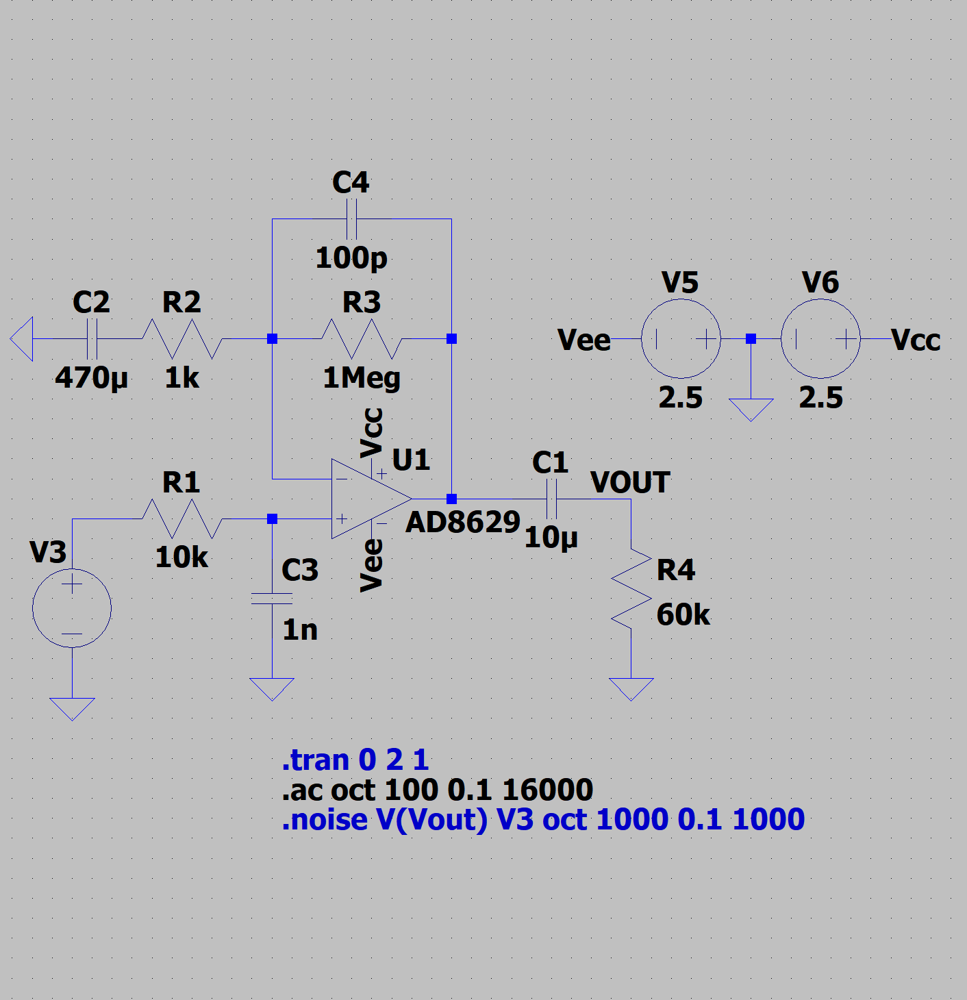
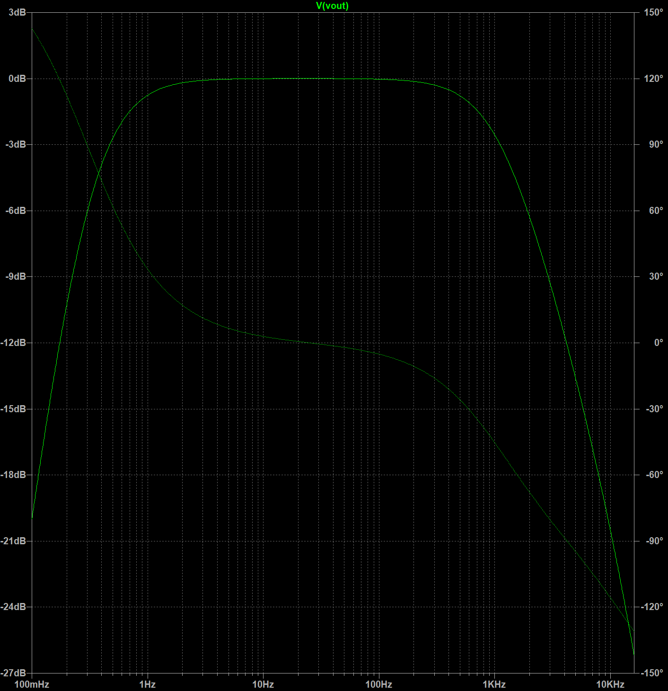
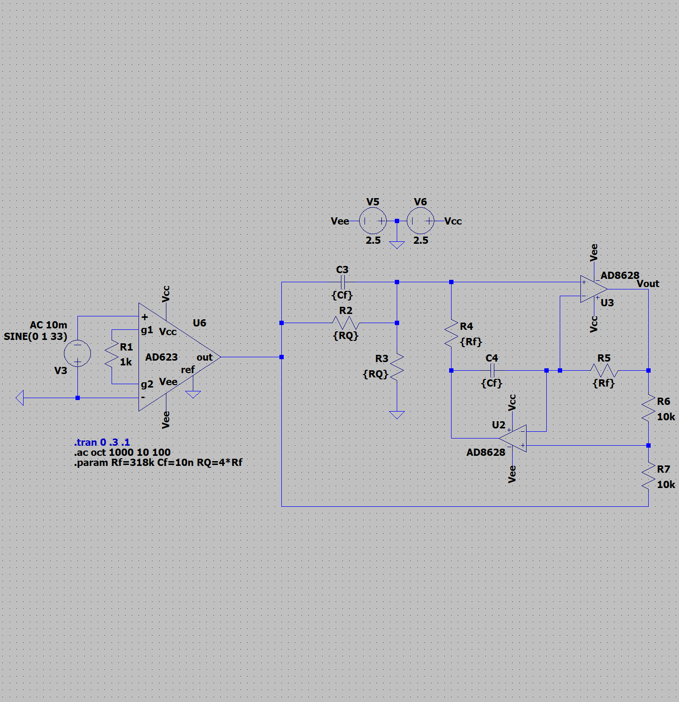
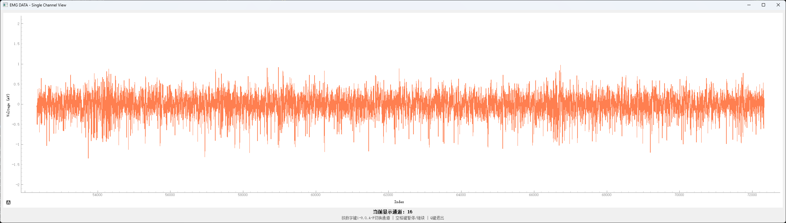

# Introduction：

The NxBCI development team consists of game engine programmers. About a year ago, we decided to enhance games with brain-computer or electromyographic control capabilities. However, after examining the existing solutions, we were not satisfied with any of them. Therefore, we decided to create a device that meets our needs, leading to the NxBCI project.This article outlines the challenges encountered during the development of NxBCI and the solutions we have currently chosen. If you have any good suggestions, please submit them to [NxBCI On Github](https://github.com/neximind/NxBCI) or contact the author via E-Mail: <mengxin@pixelgame.net>.

# NxBCI Hardware Architecture:

The traditional EEG/EMG sampling circuit uses a solution based on the ADS1299, a device introduced by TI that is a dedicated eight-channel analog front-end ADC chip for EEGs, boasting excellent performance metrics and integration. However, for our project, it is prohibitively expensive and does not meet the high sampling rate required for EMG (the measurement bandwidth for EMG must reach at least 500Hz). Therefore, we adopted a comprehensive floating-ground data acquisition solution comprising a low-noise AC amplifier -> audio ADC -> FIFO -> ESP32, which aligns well with the project requirements.

## AC Amplifiers：

Noticing the characteristics of EEG/EMG signals, they are both weak alternating current signals superimposed with a strong direct current offset (caused by the polarization effect of the electrodes), where EEG is on the order of 10uV with a bandwidth of 0.1-100Hz, and EMG is on the order of 100uV with a bandwidth of 1Hz-500Hz. If using an ADC (Analog-to-Digital Converter) for direct sampling, then the ADC must have very good performance (such as the ADS1299), which is the approach adopted by OpenBCI. If using a direct current amplifier, it requires a high-performance instrumentation amplifier along with a direct current elimination circuit, and careful distribution of the gain ratio to avoid saturating the first stage instrumentation amplifier. This design is common in traditional high-end medical instruments and can take advantage of the ultra-high common mode rejection ratio of instrumentation amplifiers to enhance performance (which is essential for non-floating designs). Both of these approaches incur high material costs, whereas NxBCI adopts integrated floating (battery-powered, WIFI data transmission), significantly alleviating common mode interference issues, and employs an AC amplifier to achieve the desired performance with a simplified circuit.

As shown in the circuit , R2 and R3 in the amplifier determine the gain, while C2 and R2 establish the high-pass frequency, and C4 and R3 set the low-pass frequency. R1 simulates the source impedance of the signal source, and R4 is the input impedance of the ADC. A balance can be struck between noise, bandwidth, and gain according to specific requirements.C2 plays a critical role in blocking the DC component and is located at the input port, which requires special attention; ceramic capacitors should be avoided due to their pronounced piezoelectric effect, which can pick up mechanical vibrations. Tantalum or solid aluminum electrolytic capacitors are viable alternatives, with tantalum capacitors particularly favored for their smaller size and superior performance. For EEG measurements requiring lower frequencies, a higher C2 (for example, a 470uF polymer tantalum capacitor) is needed. In the default PCB, we have included a 100uF capacitor, leaving solder pads for a 470uF capacitor on the reverse side, which can be added when one is interested in low-frequency signals to achieve a lower cutoff frequency.Tests have shown that the amplifier using OPA2188 offers the best cost-performance ratio. Although it is designed to operate at high voltages (36V) and does not feature rail-to-rail input characteristics, it demonstrated excellent performance with common-mode input voltages at 2.5V in experiments（VCC=5V）, providing sufficient headroom to prevent saturation caused by DC bias.

## ADC:

In order to avoid the selection of expensive synchronous sampling ADCs (such as ADS1299, AD7606, etc.), the PCM1808 has been chosen. It is a widely used and inexpensive stereo ADC with good AC characteristics. Upon careful review of its documentation, it is noted that the high-pass filter frequency response is related to the sampling rate. At an 8K sampling rate, it can go as low as 0.16Hz, which completely meets the design requirements. Its characteristics are as follows:

Parameter | value | units
|---|---|---|
Pass band		        |0.454 fs	|Hz
Stop band		        |0.583 fs	|Hz
Pass-band ripple		|±0.05	|dB
Stop-band attenuation	|-65	|dB
Delay time		        |17.4 fs	
Digital Filter Performance	-3 dB	|0.019 fs / 1000|	

Therefore, we only need to appropriately select the input coupling capacitor to ensure that the low-frequency cutoff frequency meets the requirements. Additionally, the measured reference of the PCM1808 is high impedance, suggesting that it utilizes a simple resistive voltage divider internally. For better consistency and noise performance, the reference of the eight PCM1808 units is connected to a high-quality reference voltage generated by the REF5025 (which also serves as a common-mode signal to the reference electrode output), and the power supply uses the TPS7A2050, thereby achieving excellent noise characteristics.

## Clock and FIFO:

In order to synchronize the eight PCM1808 devices (achieving 16-channel input), a 4.096Hz crystal oscillator and a master mode PCM1808 generate the SCK, BCK, and LRCK clock signals. These signals are then driven through a 74HC541 before being transferred to the ADC board, where they synchronize the operation of the slave mode PCM1808. A careful review of the timing for the IDT7204 will reveal this.

Using the BCK signal of the PCM1808 as the #W signal allows for the bit stream to be read into the FIFO. When the FIFO is half-full, data can be read via software, completing the data acquisition of 16 channels by framing the data. The D8/Q8 of the FIFO can be used to record and read the LRCK, enabling the software to easily separate the framed data after reading.

Although a clock frequency of 4.096 MHz is not high, even slight degradation of clock jitter can lead to a decline in ADC performance. Early tests revealed that the noise characteristics of the ADC were poorer the farther they were from the clock line. Only after enhancing the driving of the clock bus with the 74HC541 and adding termination resistors at the far end was a consistent level of performance achieved.

## Active Electrode:

In order to address adverse electromagnetic environments, we provide an active electrode kit. This kit features optional gain differential amplifiers of X2, X5, and X10, and offers notch filter versions for both 50Hz or 60Hz, the applications of which will be discussed later.

In practical production, we selected the INA828 and OPA2277 to construct the circuit, and we achieved excellent results in testing.

# Noise and solution:

* Thermoelectric Potential: Due to the extremely low full-scale range of the measured signal, the interference caused by the thermoelectric potential effect in the analog front end becomes significant, manifesting as a consistent low-frequency noise across all channels. This is especially pronounced when users conduct measurements using a bare PCB, where even slight airflow can induce noticeable false signals. Therefore, appropriate sealing measures are necessary.

* Piezoelectric Effect of Capacitors: Although NP0 capacitors are used in the analog front end, due to size and cost considerations, the coupling capacitors connected to the ADC are made of X7R material. This dielectric material exhibits significant piezoelectric effects; when mechanical vibrations are present, the system can pick up these interferences. Hence, necessary vibration damping measures should be implemented in such environments.

* Power Frequency Interference: Despite the use of floating systems, the common-mode rejection ratio can be weakened due to the asymmetrical impedance between the reference and input. When there are nearby high-frequency interference sources modulated by power frequency (such as faulty switching power supplies), interference energy can couple into the system through spatial capacitance, leading to significant interference. Generally, in common environments (such as bedrooms, outdoor spaces, or cafes), this interference does not significantly exceed the background noise; even if it is slightly higher, it can be eliminated through digital filtering. However, if you must contend with a harsh electromagnetic environment, it is recommended to use active electrodes. This component employs high-performance instrumentation amplifiers to extract differential mode signals and utilizes hardware notch filters to eliminate 50/60 Hz interference. The integration of this design into the electrodes also helps to minimize the length of high-impedance lines.

* Source Impedance of the Measured Target: When the electrode does not have good contact with the measured surface, it increases the source impedance, which leads to an increase in noise and makes the polarization potential less stable. Therefore, it is recommended to apply conductive paste to the electrode and ensure good contact during the measurement.

* Radio Frequency Interference: Due to the nature of NxBCI communicating via 2.4G Wi-Fi, it generates slight noise, particularly when equipped with an additional battery base. The extensive metal surface can reflect and amplify radio frequency signals, resulting in the peak noise of some channels doubling to 2uVpp during 1000X measurements, as illustrated in the accompanying figure.

    Assemble the additional battery baseplate:

    

    
    

    Embedded Battery:

    

    
    

    If you are unable to accept this situation, you can adopt the following methods to resolve it:

    1. Use a 100X gain configuration, combining an active electrode with a 10X gain setup to replace a single 1000X gain setting.

    2. Avoid using an additional battery base; instead, use an embedded battery and keep the bottom surface away from large metal areas.

    3. Hack the ESP32 antenna by cutting it at the root and connecting it to a homemade helical antenna. (A poor antenna can lead to significant losses in the ESP32's radio frequency radiation energy, unless you are exceptionally unlucky and happen to create a highly efficient antenna.) Generally, this can weaken RF interference to the point of being unmeasurable.

# Expansion and GPS: 

After completing the basic functionalities, we discovered that the ESP32 still has 4 remaining pins available for use. Among these, IO18 and IO8 can be utilized for UART or IIC communication, which we have connected through convenient 2.54mm pitch sockets to facilitate the expansion of various accessories, such as OLED displays, gyroscopes, and serial communication isolators; IO18 and IO19 are exposed as a USB host to allow for future expansions.When using the ESP32 version without PSRAM, there are 3 additional pins available, which we will use for connecting to the GPS module. The incorporation of GPS in the NxBCI is due to a request from a friend who wishes to record the relationship between muscle work state and riding position during cycling. We believe this is a reasonable request, as there is sufficient spare space on the PCB, and GPS is not as sensitive to placement as gyroscopes, making it suitable for integration into the system.