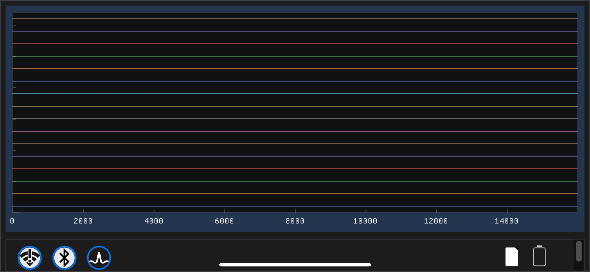
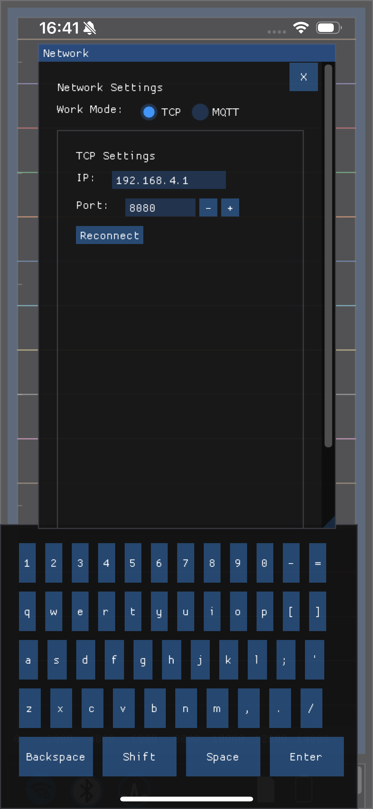
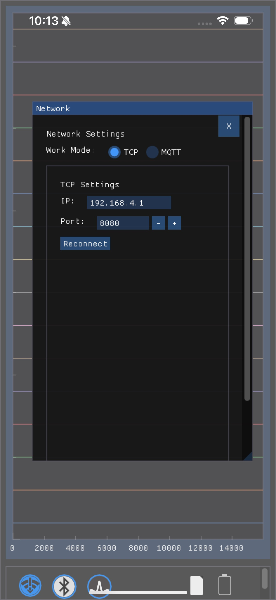
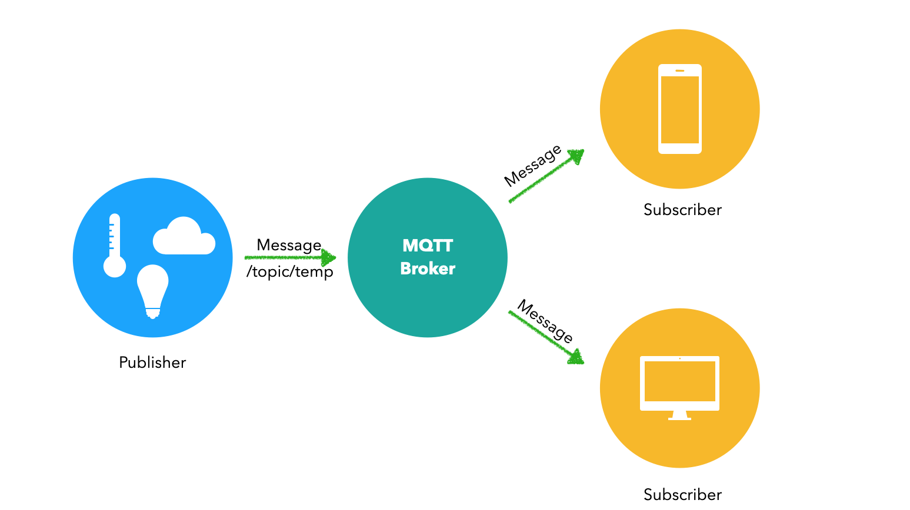
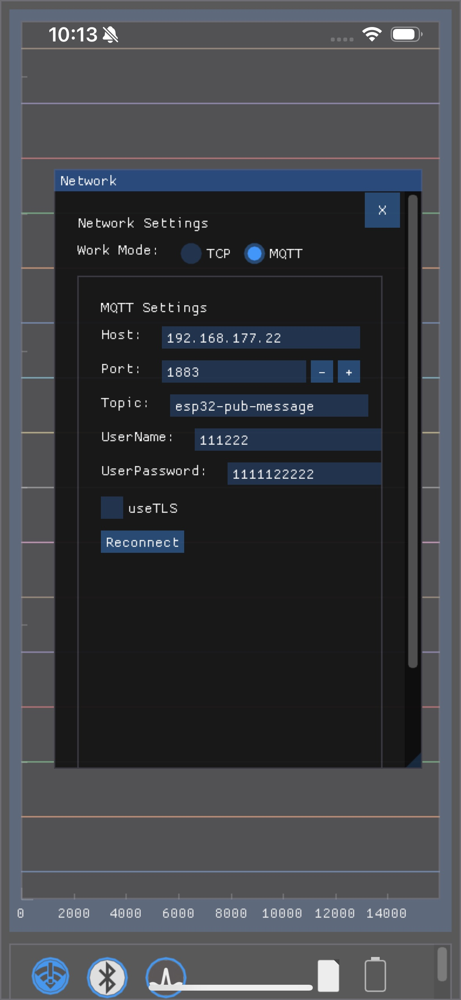
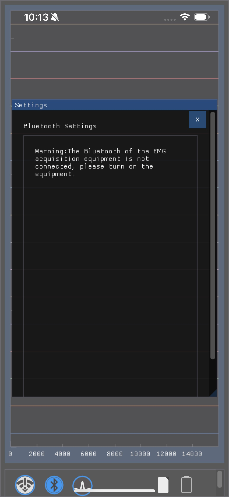
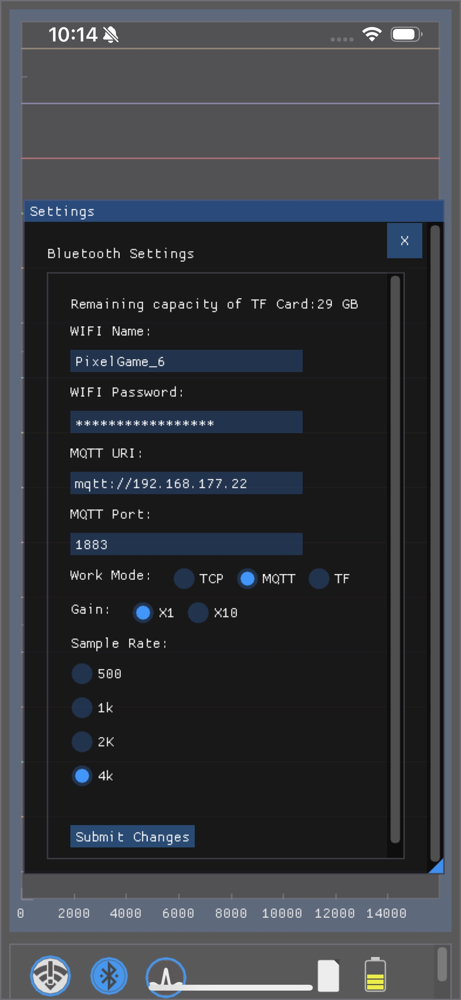
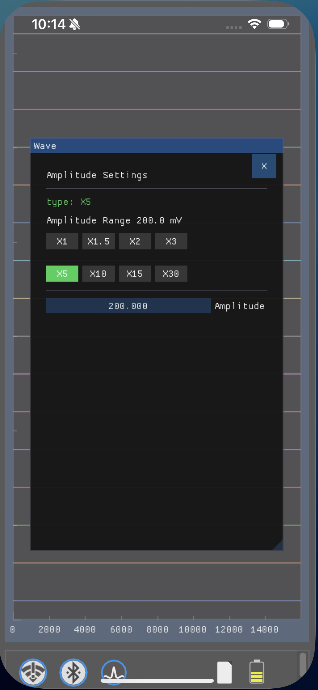
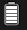
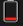

# NxBCI User Manual

Welcome to **NxBCI**! This guide will help you get started with the app and make the most out of its features.

---

## Table of Contents

- [Getting Started](#getting-started)
  - [Installation](#installation)
  - [User Interface](#user-interface)
  - [Virtual Keyboard](#virtual-keyboard)
  - [MQTT Broker Guide](#mqtt-broker-guide)
- [Main Features](#main-features)
  - [Network Settings](#network-settings)
    - [TCP Network Connection](#tcp-network-connection)
    - [MQTT Network Connection](#mqtt-network-connection)
  - [Bluetooth Connection](#bluetooth-connection)
    - [Core Device Settings](#core-device-settings)
  - [Amplitude Settings](#amplitude-settings)
  - [Status Bar](#status-bar)
- [Frequently Asked Questions (FAQ)](#frequently-asked-questions-faq)
- [Troubleshooting](#troubleshooting)
- [Contact & Support](#contact--support)

---

## Getting Started

This section walks you through the initial setup of **NxBCI**.

### Installation

1.  **Download the App:**
    - For iOS, visit the [App Store](https://www.apple.com/app-store/) to download **NxBCI**.
2.  **Install the App:**
    - Tap the "Install" button and wait for the download to complete. The app will be automatically installed on your device.

> **Note:** A stable internet connection is recommended during the installation process.

### User Interface

Upon opening **NxBCI** for the first time, you will be greeted by the main user interface.



### Virtual Keyboard

When you select a text field, a virtual keyboard will appear on the screen to allow for input.



The keyboard functions as follows:

*   **Default View:** Provides all lowercase letters and numbers.
*   **`Shift` Button:** Click this to switch between lowercase and uppercase letters/common symbols.
*   **`BackSpace` Button:** Click this to delete the previously entered character.
*   **`Enter` Button:** Confirms the input and closes the keyboard.

### MQTT Broker Guide

if you want use the device in the MQTT mode,you should watch this,or you can jump this.

there are two types MQTT Broker set up situation.

#### Local Area Network (LAN) Broker Setup

Using Mosquitto to set up an MQTT broker on your local network is an excellent and popular choice. This allows your devices to communicate directly with each other without needing an internet connection.

Here is a step-by-step guide for both macOS and Windows.

---

##### For macOS
1. Once Homebrew is installed, run this command in your Terminal:

    ```bash
    brew install mosquitto
    ```
2. Configure Mosquitto
For local network access, you need to tell Mosquitto to listen for connections from other devices.

* Find your configuration file. 
  On Apple Silicon (M1/M2), it's typically at 
  ```
  /opt/homebrew/etc/mosquitto/mosquitto.conf
  ```
  On Intel Macs, it's at
  ``` 
  /usr/local/etc/mosquitto/mosquitto.conf
  ```
* Open the mosquitto.conf file with a text editor and add the following lines to the end of the file. This allows any     device on your network to connect without a username or password.
  ``` mosquitto.conf
  listener 1883 your_mac_IP
  allow_anonymous true
  ```
3. Start the Mosquitto Broker
You can run the broker in two ways:
* As a background service (Recommended): This will start Mosquitto automatically and keep it running in the background.
  ```
  brew services start mosquitto
  ```

* Manually in the foreground: This is useful for debugging as you will see log messages directly in the terminal window.
```
  # For Apple Silicon Macs
  mosquitto -c /opt/homebrew/etc/mosquitto/mosquitto.conf
  # For Intel Macs
  mosquitto -c /usr/local/etc/mosquitto/mosquitto.conf
```

##### For Windows PC
1. Download the Installer
* Go to the official Mosquitto download page: https://mosquitto.org/download/
* Download the latest native installer for your version of Windows (e.g., mosquitto-install-windows-x64.exe).

2. Install Mosquitto

* Run the downloaded .exe file.
* Follow the installation wizard. When prompted, ensure that the "Service" component is selected for installation. This will allow Mosquitto to run automatically as a background service.
* The default installation directory is usually C:\Program Files\mosquitto.

3. Configure Mosquitto
* Navigate to the Mosquitto installation directory (e.g., C:\Program Files\mosquitto).
* Find the mosquitto.conf file. You may need to create a mosquitto.conf if it's not present in the root.
* Open mosquitto.conf with a text editor and add the following lines to the end of the file to allow connections from other devices on your network:
  ```
  listener 1883 your_windows_PC_ip

  allow_anonymous true
  ```
4. Start the Mosquitto Broker
* As a Windows Service (Recommended):
  1. Press Win + R, type services.msc, and press Enter.
  2. Find "Mosquitto Broker" in the list.
  3. Right-click it and select Start.
* Manually in the foreground:
  1. Open CMD
  2. Navigate to the installation directory: cd "C:\Program Files\mosquitto"
  3. Run the broker with the command: mosquitto.exe -c mosquitto.conf

#### Using a Cloud MQTT Broker

For remote access from anywhere in the world, a cloud-based MQTT broker is the ideal solution. Unlike a local network setup, a cloud broker allows you to receive data from your device no matter where it is, as long as both the device and your **NxBCI** app have an active internet connection.

##### Choosing a Cloud Service

You have two main options for setting up a cloud broker:

> **1. Managed MQTT Services (Recommended for most users)**
> These platforms specialize in providing MQTT as a service. They handle the setup, maintenance, and scaling for you, making them very easy to get started with. Many offer generous free tiers perfect for personal projects.
>
> *   [**EMQX Cloud**](https://www.emqx.com/en/cloud)
> *   [**HiveMQ Cloud**](https://www.hivemq.com/mqtt-cloud-broker/)
> *   [**AWS IoT Core**](https://aws.amazon.com/iot-core/) (More advanced)

> **2. DIY on a Virtual Private Server (VPS) (Advanced)**
> This involves renting a bare cloud server from a provider and installing MQTT broker software (like Mosquitto) yourself. This option offers maximum flexibility but requires more technical knowledge.
>
> *   [**DigitalOcean**](https://www.digitalocean.com/)
> *   [**Linode**](https://www.linode.com/)
> *   [**Vultr**](https://www.vultr.com/)

##### General Setup Steps

Regardless of the provider you choose, the general workflow is as follows:

1.  **Create the Broker Instance:**
    Sign up with your chosen provider and create a new MQTT broker instance.

2.  **Obtain Connection Credentials:**
    After setup, the service will provide you with critical connection details. You will need these for both your device and the NxBCI app. They typically include:
    *   **`Host`**: The server address (e.g., `broker.hivemq.com` or an IP address).
    *   **`Port`**: The port number for the connection.
    *   **`Username` / `Password`**: Credentials for authentication.
    *   **`TLS/SSL`**: Whether to use a secure, encrypted connection (highly recommended).

3.  **Configure Your Device:**
    *   Connect to your device via **Bluetooth**.
    *   Go to the **Device Settings**.
    *   Enter the cloud broker's `Host`, `Port`, `Username`, and `Password` into the device's MQTT settings.
    *   Set the device to connect to a Wi-Fi network that has **internet access**.
    *   Submit the changes and let the device restart. It will now attempt to connect and publish data to your cloud broker.

4.  **Configure NxBCI:**
    *   In the **NxBCI** app, go to the **Network Settings**.
    *   Enter the **exact same** broker credentials (`Host`, `Port`, `Topic`, etc.) that your device is using.
    *   Click `Reconnect`. The app will now subscribe to the topic on the cloud broker and start receiving data from your device, wherever it may be.

---

## Main Features

Here is a breakdown of the core features of **NxBCI**.

### Network Settings

The Network Settings button, located at the top-right, indicates the current network status and allows you to configure your connection.

*    **Connected:** The app has an active connection (via TCP or MQTT).
*    **Disconnected:** The app is not connected.

Clicking this button opens the network configuration panel.

#### TCP Network Connection

To connect directly to the device via TCP:

1.  Click the Network Settings button and switch the connection type to **TCP**.
2.  Ensure the following prerequisites are met:
    *   The device's work mode is set to **TCP** (this can be changed in the Bluetooth settings).
    *   Your phone is connected to the device's Wi-Fi network, named **`ESP32-EEG`**.
3.  Click the **`Reconnect`** button to establish the connection.



#### MQTT Network Connection



MQTT allows you to receive data from our devices remotely, well beyond the typical Wi-Fi range. Thanks to its publish-subscribe mechanism, you can also view the data simultaneously on multiple platforms, such as your iPhone, iPad, Windows PC, and Mac.

Follow these steps to configure your app to **subscribe** to messages from an MQTT Broker:

1.  **Set Up Your Broker:** First, ensure your device is configured to publish data to a broker. Refer to the "**MQTT Broker Guide**" for instructions.
2.  **Enter Broker Details:** In the MQTT settings panel, enter the connection details provided by your broker.
    *   **`Host` and `Port`**: Your broker's server address and port number.
    *   **Credentials (If required)**: If you are using a cloud MQTT broker or one that requires authentication, fill in the `Topic`, `UserName`, and `Password`.
    *   **Security (If required)**: Enable `TLS` if your broker uses a secure (encrypted) connection.
3.  **Connect and Receive Data:** Click the **`Reconnect`** button to apply the settings and connect.



### Bluetooth Connection

The Bluetooth connection button indicates the current status and is the gateway to all device-specific settings.

*    **Disconnected:** The device is not connected via Bluetooth.
*    **Connected:** The device has an active Bluetooth connection.

---

#### If Bluetooth is Disconnected

When the status is disconnected, clicking the button () will open the Bluetooth scanning dialog, allowing you to search for and connect to your device.



#### If Bluetooth is Connected

When the device is already connected, clicking the button () will open the main settings panel.



### Core Device Settings

The Bluetooth connection is essential for configuring the device's most important properties. From the settings panel, you can control:

*   **Wi-Fi:** The Wi-Fi network the device will connect to.
*   **MQTT Broker:** The server to which the device will publish messages.
*   **Work Mode:** The device's primary operational mode (e.g., TCP or MQTT).
*   **Gain:** The signal gain of the device.
*   **Sample Rate:** The sample rate of the device. This setting takes effect immediately.

> **Important:** For all settings *except Sample Rate*, you must click the **`Submit Changes`** button and wait for the device to restart for the changes to take effect.

### Amplitude Settings

Clicking the Amplitude Settings button  opens the panel shown below. This panel allows you to adjust the vertical display scale for each channel's received data.



The scale is calculated from a **100mV** base amplitude. The multiplier you select scales this base value. For example, choosing `X1.5` sets the display scale to **150mV** (`100mV * 1.5`).

You can choose from the following 8 presets:

*   `X1`
*   `X1.5`
*   `X2`
*   `X3`
*   `X5`
*   `X10`
*   `X15`
*   `X30`

This provides a total adjustment range from **100mV** (at X1) to **3000mV** (at X30).

### Status Bar

The status bar, located at the bottom-right corner of the screen, provides at-a-glance information about storage and battery levels.


---

#### Storage Space

This icon indicates the remaining space on the TF card.

*    **Ample Space:** The TF card has plenty of free space.
*    **Partially Used:** The TF card has been partially used.
*    **Almost Full:** The card is nearly full. It is recommended to clear some space soon.

---

#### Battery Status

This icon displays the current battery level.

*    **Full:** The battery is fully or almost fully charged.
*    **Medium:** The battery is partially depleted.
*    **Low:** The battery level is critically low. Please charge the device soon.

---

## Frequently Asked Questions (FAQ)


---

## Troubleshooting

If you encounter any issues, try these common solutions:

- **App is not responding:**
  - Close and reopen the app.
  - Restart your phone or tablet.
- **Unable to connect to the Network (TCP/MQTT):**
  - Double-check all your settings (Host, Port, Topic, etc.).
  - Ensure your phone has a working internet connection (for MQTT) or is on the correct Wi-Fi network (for TCP).
- **Unable to connect via Bluetooth:**
  - Ensure Bluetooth is enabled on your phone.
  - Make sure the device is powered on and within range.
  - Try restarting both your phone and the device.
  - Ensure the other phone or PC is not occupying the device's Bluetooth.

> If you're still having trouble, please reach out to our support team.

---

## Contact & Support

We're here to help! For further assistance, please visit our official website.

- **Website:** [www.neximind.com](https://www.neximind.com)