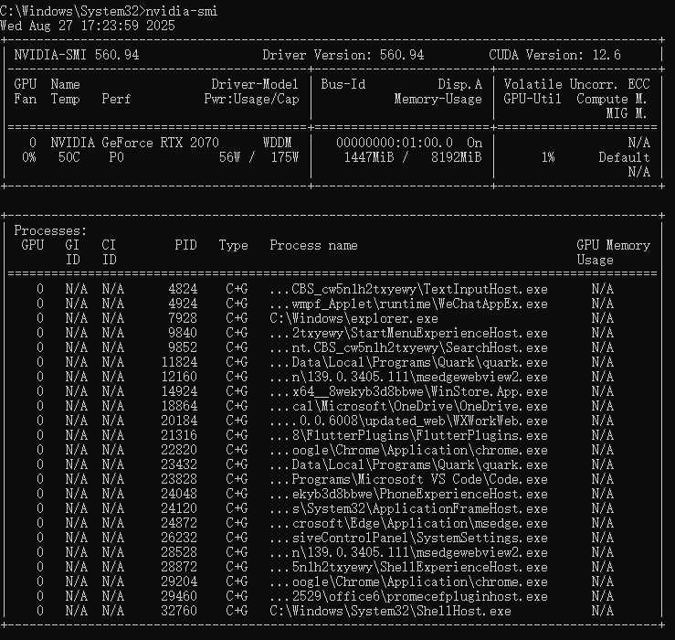
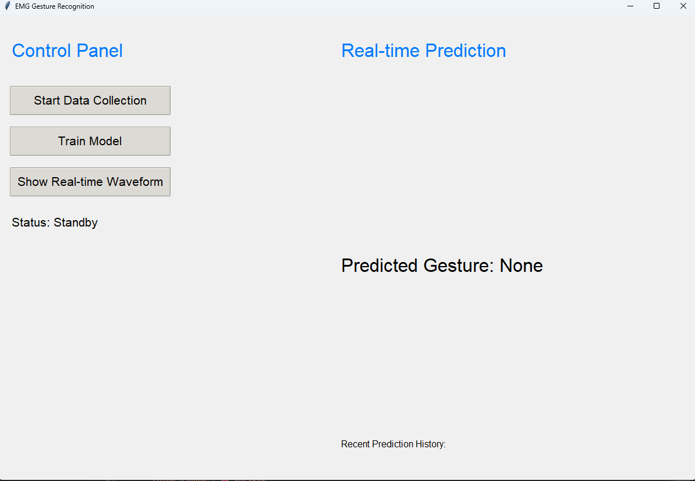
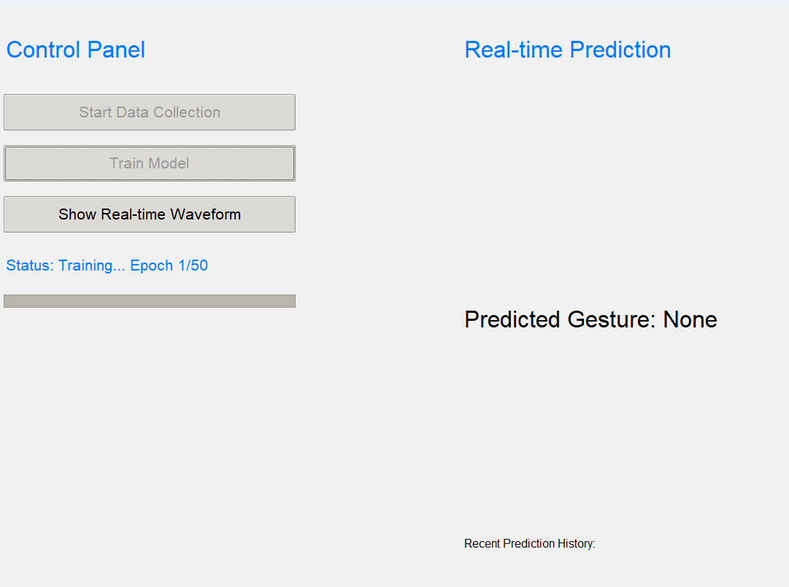

# Gesture Recognizer 🤖

> **Real-time EMG-based hand gesture recognition powered by deep learning**

An intelligent application designed for the **NxBCI EEG/EMG device** that enables seamless collection of EMG data, neural network training, and real-time hand gesture recognition.

📋 **[Learn more about the NxBCI device →](https://www.neximind.com/products-solutions/hardwares/nxbci)**

---

## Architecture Overview

The application consists of three core components working in harmony:

| Component | Function | Description |
|-----------|----------|-------------|
| **🖥️ GUI Interface** | User Interaction | Intuitive interface for data collection, model training, and prediction visualization |
| **🧠 Gesture Classifier** | Deep Learning Engine | Neural network that learns to differentiate between various hand gestures |
| **📡 TCP Receiver** | Data Communication | Receives real-time EMG data streams from NxBCI device |

---

## Setup and Installation

### Prerequisites

Ensure you have the following before starting:

- ✅ **Python 3.8+** installed
- ✅ **NxBCI EEG/EMG device** ready for use
- ✅ **NVIDIA GPU** (optional, but highly recommended for faster training)
- ✅ Stable wireless network connection

### Installation Steps

#### 1. Clone the Repository
```bash
git clone https://github.com/neximind/NxBCI.git
cd application/GesturesRecognition
```

#### 2. Set Up Virtual Environment (Recommended)
```bash
# Create virtual environment
conda create -n Gesture_Recognition python=3.9

# Activate virtual environment
conda activate Gesture_Recognition
```

#### 3. Install Dependencies
```bash
pip install -r requirements.txt
```

#### 4. Install PyTorch with GPU Acceleration

For significantly faster model training, install PyTorch with GPU support.

##### Check Your CUDA Version(For Windows/Linux)

First, determine your GPU's maximum supported CUDA version:

```bash
nvidia-smi
```

Look for `CUDA Version: X.X` in the top-right corner of the output.



> **💡 Pro Tip:** You can install CUDA for this version or any lower version (e.g., if you see 12.6, you can use 12.1 or 11.8).

##### Install PyTorch

1. Visit the **[PyTorch Official Website](https://pytorch.org/get-started/previous-versions/)**
2. Select your configuration:
   - **OS**: Windows/macOS/Linux
   - **Package Manager**: Conda
   - **Compute Platform**: CUDA version ≤ your driver version

**Example installation commands:**

```bash
# For CUDA 12.1
conda install pytorch==2.5.1 torchvision==0.20.1 torchaudio==2.5.1 pytorch-cuda=12.1 -c pytorch -c nvidia

# For macOS
conda install pytorch==2.5.1 torchvision==0.20.1 torchaudio==2.5.1 -c pytorch

# CPU-only (if no GPU available)
conda install pytorch==2.5.1 torchvision==0.20.1 torchaudio==2.5.1 cpuonly -c pytorch
```

##### Verify Installation

Test your PyTorch installation:

```python
import torch

device = torch.device("cpu")

if torch.cuda.is_available():
   device = torch.device("cuda")
   print(f"Using CUDA: {torch.cuda.get_device_name(0)}")

elif hasattr(torch.backends, 'mps') and torch.backends.mps.is_available() and torch.backends.mps.is_built():
   device = torch.device("mps")
   print("Using Apple Silicon MPS")

else:
   print("Using CPU")
```

---

## Getting Started

### Step 1: Hardware Setup

> **⚡ Important:** Follow these steps in exact sequence for proper device connection

1. **Power On Device**
   - Turn on your NxBCI device and wait for initialization to complete

2. **Switch to TCP Mode**
   - Set your NxBCI device to **TCP mode**

3. **Network Connection**
   - Connect your computer to the Wi-Fi network: **`ESP32-EEG`**
   - Wait for stable connection establishment

4. **Test Connection (Optional)**
   ```bash
   python Examples/TCP_Receiver_demo.py
   ```
   You should see real-time EMG multi-channel plots

5. **Verify Connection Status**
   - 🔄 **Blinking LED**: Device ready for connection
   - 🔵 **Solid Blue LED**: Connection established successfully
   
   > ⚠️ **Important:** The device supports only **one TCP client** at a time. Close `TCP_Receiver_demo.py` before proceeding.

### Step 2: Launch Application

Start the main application from the project root directory:

```bash
python App.py
```

You should see the main interface with three primary functions:
- 📊 **Data Collection**
- 🎯 **Model Training** 
- 👁️ **Live Predictions**



### Step 3: Using the Application

#### Data Collection

The data collection process captures EMG signals for different hand gestures through six sequential phases:

1. **Calibration Phase**
   - Keep your arms completely relaxed and still
   - This establishes a baseline to filter out movement artifacts

2. **Fist Gesture**
   - Clench your fist and maintain the position
   - Follow on-screen timing instructions

3. **Wrist Left**
   - Move your wrist to the left and hold the position
   - Maintain consistent muscle tension during collection

4. **Wrist Right**
   - Move your wrist to the right and hold the position
   - Keep the movement steady and controlled

5. **Fingers Apart**
   - Spread all five fingers wide apart
   - Focus on strengthening tension in middle and ring fingers
   - This helps distinguish from the victory gesture

6. **Victory Gesture**
   - Make a "V" or scissors gesture with index and middle fingers
   - Perform the gesture quickly and repeatedly during collection
   - Avoid clenching when retracting fingers to prevent confusion with fist gesture

> **📁 Data Storage:** Each gesture's EMG data is saved as a separate file. Back up existing data before collecting new samples to prevent overwriting.

#### Model Training

Click "Train Model" to start the neural network training process:



- Expected completion time: **< 1 minute** with GPU/MPS acceleration
- Training typically converges within **50 epochs**
- Progress bar shows real-time training status

> **⚠️ Performance Note:** If training is slow, verify that PyTorch is using GPU acceleration.

Upon completion, the application automatically activates real-time prediction mode for immediate testing.

---

## Configuration

Customize the application by modifying the `CONFIG` dictionary in `App.py`:

### Core Parameters

| Parameter | Default | Description | Notes |
|-----------|---------|-------------|-------|
| `data_channels` | `8` | Number of EMG channels | Must match device configuration |
| `sample_rate` | `500` | Sampling frequency (Hz) | Standard for EMG signals |
| `duration` | `4.0` | Calibration duration (seconds) | Baseline recording time |

### Signal Processing

| Parameter | Default | Description | Purpose |
|-----------|---------|-------------|---------|
| `window_time` | `0.20` | Analysis window (seconds) | 200ms windows for gesture detection |
| `stride_ratio` | `0.5` | Window overlap ratio | 50% overlap for smooth recognition |

### Training Parameters

| Parameter | Default | Description | Recommendations |
|-----------|---------|-------------|----------------|
| `epochs` | `50` | Maximum training iterations | Early stopping prevents overfitting |
| `batch_size` | `64` | Training batch size | Reduce if memory issues occur |
| `learning_rate` | `0.001` | Optimizer learning rate | Start conservative, tune as needed |

---

## Troubleshooting

### Connection Issues

**Problem:** LED keeps blinking
- **Solution:** Verify computer is connected to `ESP32-EEG` network
- **Check:** Ensure stable Wi-Fi connection

**Problem:** No data received
- **Solution:** Confirm only one device is connected to the TCP server
- **Check:** Close any other applications using the device

### Performance Issues

**Problem:** Slow training performance
- **Solution:** Verify GPU/MPS acceleration is working using the test script
- **Check:** Ensure CUDA/MPS-enabled PyTorch is properly installed

**Problem:** Poor gesture recognition accuracy
- **Solution:** Open waveform display to check for electromagnetic interference
- **Check:** Ensure proper electrode placement and clean contact

### Application Issues

**Problem:** Import errors on startup
- **Solution:** Activate virtual environment before running application
- **Check:** Verify all dependencies are installed

**Problem:** Model training fails
- **Solution:** Confirm EMG data is being received properly
- **Check:** Test connection with the demo script first

**Problem:** GUI becomes unresponsive
- **Solution:** Close and restart application
- **Check:** Monitor system resources and close unnecessary programs

---

## Quick Start Checklist

Use this checklist to ensure proper setup:

**Software Setup:**
- [ ] Python 3.8+ and Conda installed
- [ ] Repository cloned and virtual environment activated
- [ ] All dependencies installed from `requirements.txt`
- [ ] PyTorch with GPU/MPS support installed and verified

**Hardware Setup:**
- [ ] NxBCI device powered on and in TCP mode
- [ ] Computer connected to `ESP32-EEG` network
- [ ] Device LED shows solid blue (connected status)
- [ ] Connection tested with demo script

**Application Ready:**
- [ ] Configuration parameters reviewed
- [ ] Application launched successfully with `python App.py`
- [ ] All three main functions accessible

---

## Support and Resources

### Getting Help
- **Examples:** Check the `Examples/` directory for reference implementations
- **Configuration:** Review parameters to match your hardware setup
- **Installation:** Ensure all prerequisite software is correctly installed

---

*For technical support, please visit our [GitHub Issues](https://github.com/neximind/NxBCI/issues) page.*