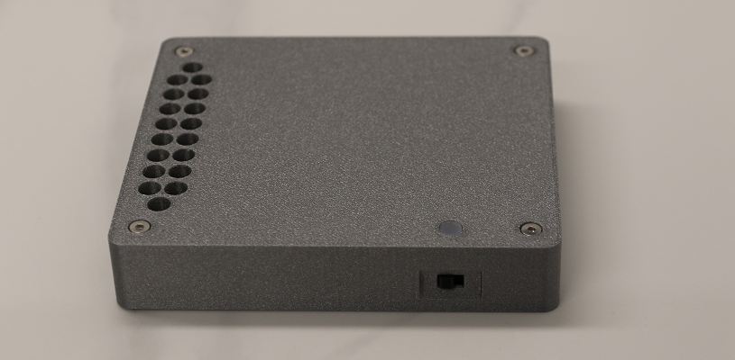
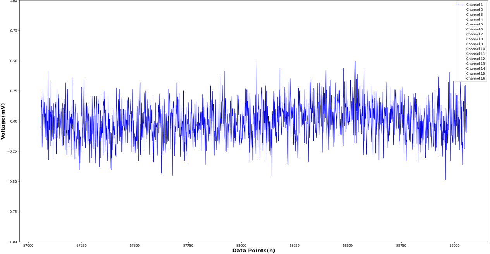
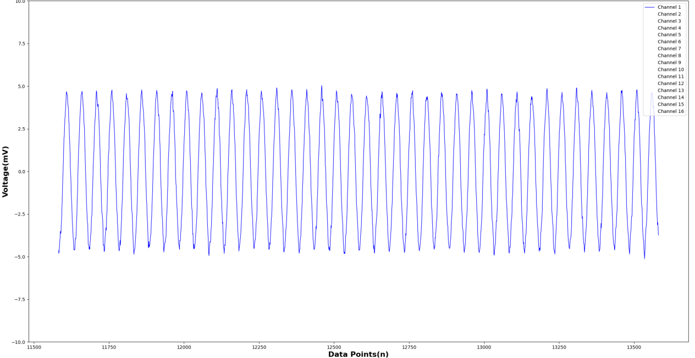
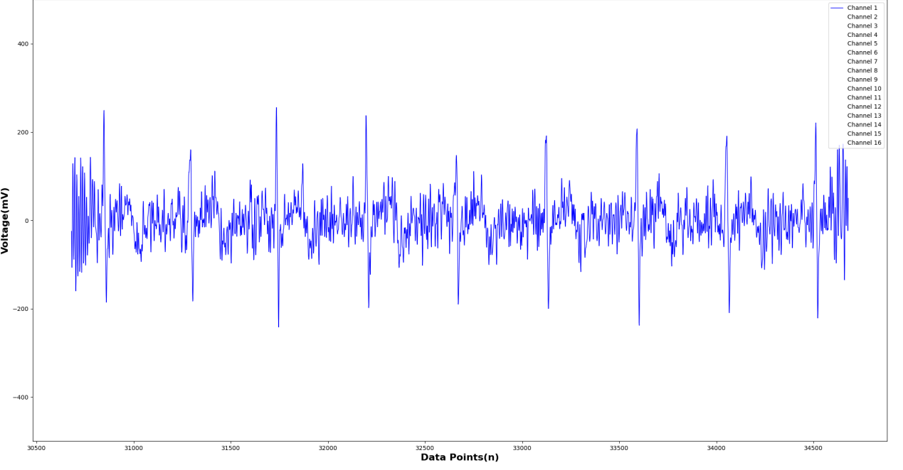
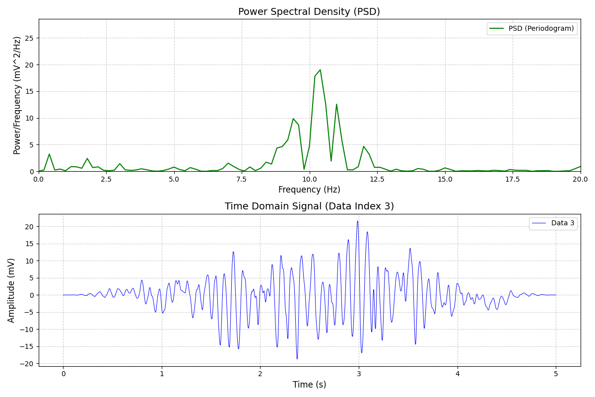
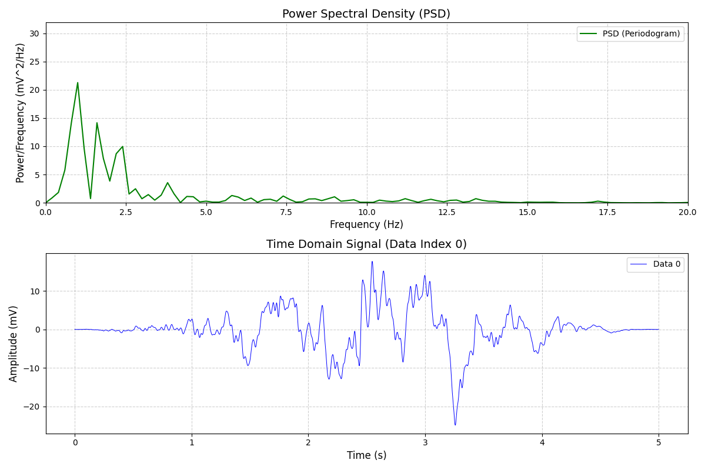
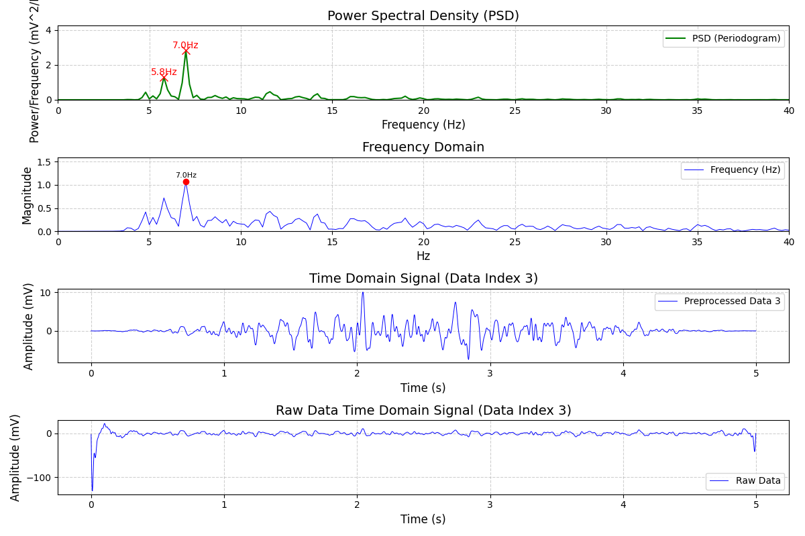
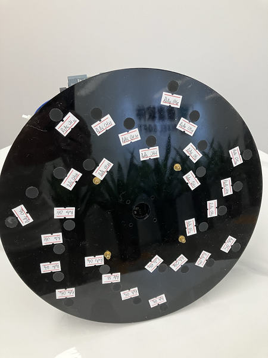
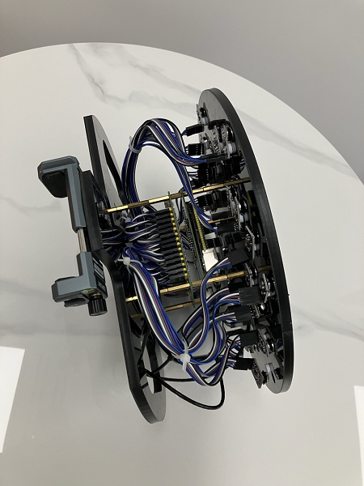
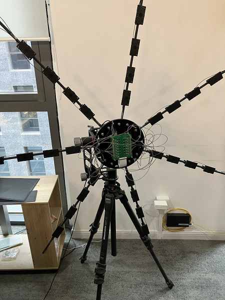

# NxBCI 脑电图信号（EEG）/肌电图（EMG）信号采集器/记录仪

## 项目介绍：
NxBCI 旨在构建一个 EEG /EMG 数据采集系统，该设备可用于科研，教学，以及消费类电子产品。
NxBCI 具有 16 通道，每通道具有 24bits 分辨率，以及高达 4KHz 的采样率，
配合低噪声前置放大器，可以在 3mVpp 的测量范围内取得 10ppm（万分之一） 的有效分辨率，
以及（等效输入）低于 1uVpp（0.2uV RMS）的噪声特性，
同时该套件具有2.4G WIFI 用于输出数据（TCP 或 MQTT），蓝牙用于设置控制，以及内嵌的GPS接收机。
此外还具有 TF 插槽用于离线数据采集模式，在使用大容量锂电池配置时足以支持24小时的HOLTER模式，
该设备具有扩展接口（ USB-TypeA 和 4pin UART/IIC ），可以接 外置加速度计-陀螺仪-磁力计，隔离 UART 通信组件等其他扩展设备，USB-TypeC 接口的充电管理电路和编程调试端口以便DIY用户深度定制。

## Project Introduction:
NxBCI aims to construct an EEG/EMG data collection system that can be used for research, education, and consumer electronic products. The device features 16 channels, each with a resolution of 24 bits and a sampling rate of up to 4 kHz. With a low-noise front-end amplifier, it can achieve an effective resolution of 10 ppm (parts per million) within a measurement range of 3 mVpp, along with a noise characteristic (equivalent input) of less than 1µVpp (0.2 µV RMS). Additionally, the kit includes 2.4G Wi-Fi for data output (TCP or MQTT), Bluetooth for setup control, and access to secondary sensor data. Furthermore, it has a TF slot for offline data collection mode, which is sufficient to support a 24-hour HOLTER mode when configured with a large-capacity lithium battery. The device also features two expansion interfaces (USB-A and 4pin UART/IIC) for connecting external accelerometer-gyroscope-magnetometer components, isolated UART communication modules, and other expansion devices. The USB-Type C interface includes a charging management circuit and programming/debugging port for DIY users to customize extensively.

## 技术指标：
参数|单位|最小值|典型值|最大值
|---|---|---|---|---|
采样率|SPS|500|1000|4000*
本底噪声|uVrms|-|0.16|-
-3DB频率范围|Hz|0.1|150|1.5K*
分辨率|Bits|24|24|24
满量程范围|mVpp|3|3|30*

连接模式：
1. 本地 TCP连接；
2. 云端MQTT；
3. 脱机记录至 TF Card；
4. 通过隔离的 UART 接口连接至其他设备 **

供电模式：
1. 5000mAH 扁平锂离子电池；
2. 4节 18650 圆柱锂离子电池；
3. 6节 AA 碱性电池，或镍氢电池；

扩展接口:

1. USB type A Host;
2. 2.54mm 4PIN 接口，可用于 IIC/UART 与扩展器件通信；

附属功能：GPS***；

*EMG模式下 

**需要扩展选件支持

***GPS 根据当地法律规定选配

## 套件类型：
 

[99$ PCB Only] 适合电子爱好者，价格低廉，适合学习，可方便的集成进其他系统协同工作。

[149$ 标准外壳 + 连接线 + 无源肌电腕带 DIY 套件 + 精美包装]，适合大部分用户

[199$ 标准外壳 + 加强外壳 + 两种电池适配器底座 + 连接线 + 有源肌电腕带 DIY 套件 + UART信号隔离器 + 精美包装]，适合应对更强干扰环境或者需要更强续航能力的用户

## 免责声明：

1. 由于该设备会直接与人体进行电气连接，所以安全是其首要考虑，所以任何情况下都应将该设备浮置（即只连接待测目标），如果作为子设备与其他设备连接必须使用可靠的隔离器件通信，禁止在充电过程中将设备连接至人体，如果这样做一旦充电器失效，可能导致其与市电连通，这将引起致命后果。知晓生物电信号测量的相关安全规则是用户的责任，请您在使用前确保了解相关的知识。

2. 该设备不可作为医学用途，其数据也不应视作医疗参考。

3. 该设备尚未取得 UN38.3 认证，请您确保能应对潜在电池失控燃烧甚至爆炸的风险，并遵守当地关于含有锂电池电子设备运输的相关法规。

## Disclaimer:
1. As this device will directly connect electrically with the human body, safety is its primary consideration. Therefore, under any circumstances, the device should remain floating (i.e., connected only to the target under test). If it is to be connected as a sub-device to other equipment, reliable isolation devices must be employed for communication. It is prohibited to connect the device to a human body while it is charging; doing so could result in it becoming connected to the mains electrical supply if the charger fails, which could lead to fatal consequences. It is the user's responsibility to be aware of the relevant safety regulations regarding biopotential signal measurements. Please ensure that you are familiar with the pertinent knowledge before use.

2. This device is not intended for medical purposes, and its data should not be considered as medical reference.

3. This device has not yet obtained UN38.3 certification. Please ensure that you can manage the potential risks of battery runaway combustion or explosion, and comply with local regulations regarding the transport of lithium battery-powered electronic devices.

## 典型应用：

NxBCI 是一个多通道生物电信号采集设备，您可以利用她产生的数据进行各种有趣的事，并且在这个过程中，你可以实际接触到很多数值分析工具以及 AI 算法，这样或许能让您的课程变得不那么痛苦；） 

我们列举了一些可能的应用场景：

1. 睡眠质量分析。
2. 肌肉的运动与康复检测，（比如智能健身器材。）
3. 肌电控制系统（比如游戏外设）。
4. 心电的观测（非医学目的）。
5. MI，SSVEP 等脑电控制系统。
6. 电阻抗成像。
7. 动物运动分析。

## Typical Applications:

NxBCI is a multi-channel bioelectrical signal acquisition device, you can use the data it generates to do all kinds of interesting things, and in the process, you can actually come into contact with a lot of numerical analysis tools and AI algorithms, which may make your course less painful ;）

Here are some possible use cases:

1. Sleep quality analysis.
2. Muscle movement and rehabilitation testing, (such as smart fitness equipment.) 
3. EMG control systems (such as game peripherals).
4. Observation of ECG (for non-medical purposes).
5. EEG control systems such as MI and SSVEP.
6. Electrical impedance imaging.
7. Animal movement analysis.

## 硬件使用说明：
 唐完成这里 
[NxBCI Hardware User manual](https://www.github.com)

## 如果您希望了解更多该项目的细节：
 孟完成这里 
[More About NxBCI](https://www.github.com)

## 如果您需要采购相关配件，可以参考下面表格：
 唐完成这里 
[How to purchase accessories.](https://www.github.com)

## APP 和 SDK：
	
 雷完成这里 

我们提供了 Windows MacOS IOS Android 平台下的 App ， 以便于用户通过蓝牙设备控制设备的工作模式，同时也可以看到数据的实时波形。

[NxBCI Software user manual]( https://www.github.com)

各平台的下载链接：

[Windows]( https://www.github.com)
[MacOS]( https://www.github.com)
[IOS]( https://www.github.com)
[Android]( https://www.github.com)
   
我们也提供了 Python 接口的 API， 便于用户和设备交互和数据接收，从而将他集成进您的系统中。

[NxBCI SDK]( https://www.github.com)

## 实测数据：

1. 输入短路后的噪声特性（X1000倍）

    

2. 使用信号发生器产生频率为10Hz、10uV p-p的正弦波作为EasyBCI设备的输入信号，时域特性

    

3. 捏住电极测得的心电。                

    

4. 闭眼，睁眼状态下受试者的 alpha 波。

闭眼：

    

睁眼：

    

5. SSVEP 7Hz 响应

    

6. SSVEP 测试影像

    <video src="./media/video/ssvep.mp4" height="400" width=auto controls></video>    

7. Alpha 测试影像

    <video src="./media/video/alpha.mp4" height="400" width=auto controls></video>    

9. sEMG 测试影像 （使用 ios App 录制）

     <video src="./media/video/emg.mp4" height="400" width=auto controls></video>    

## 团队和价值观：

我们是来自游戏公司的电子爱好者，对技术有着极大的好奇与热情，
但是由于目前在售的BCI产品太过昂贵，于是我们打算自己做一个便宜的替代物，
在艰苦的实验后我们发现音频 ADC 意外的强悍（我们甚至将其用于声学相机，他不久的将来也会跟大家见面），
于是有了目前的方案，由于缺乏专业的设备，我们无法确保这个设备能达到ADS1299方案的效果，
如果您在意的是有芯片厂家保证的专业设备，那么请选择 ADS1299 或等价的方案，
如果您有足够的测试能力能为我们提供交叉比较测数据数据，我们将非常感激，
我们做出他是希望更多好奇的孩子可以用来实现自己的想法，比如利用EMG数据控制假肢之类的应用，或许就能帮助到需要的人。

## 期待您的参与：

由于具体的应用已经超出了我们的能力，最佳的选择就是将平台开放，让大家参与开发，在这里我们建设了一个交流的平台，您可以将新的想法，修改意见，遇到的问题等告知我们，非常期待您的关注与参与。

 魏完成这里 
[NxBCI 讨论组](https://www.github.com)

## 未来的计划：

我们团队希望募集到足够的资金用于开模，以便替代掉目前3D打印的外壳，并进一步研发对扩展附件的支持，还有一部分资金将用于继续声学相机项目，希望得到您的理解与支持，将更大的惊喜呈现给您。     

这是目前处在原型阶段的声学相机

